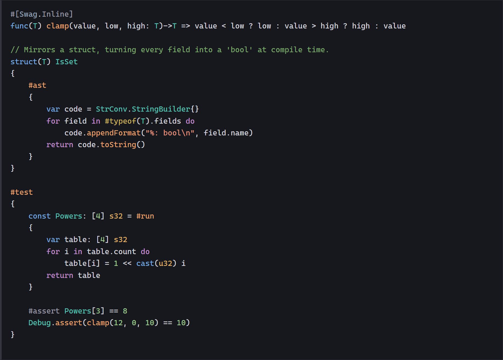

<p align="center">
    
</p>

<h1 align="center">Swag</h1>

<p align="center"><b>A systems language that runs at compile time.</b></p>

> [!WARNING]
> Work in progress! There is no official release yet, and this repository publishes no binaries:
> `swc` is built from source. Expect bugs, breaking changes, and silly decisions.

**Swag** is the language, **`swc`** is its compiler. `swc` emits Windows x86-64 executables and
libraries with its own native backend, and it runs the same language through a JIT while compiling.
Compile-time code and runtime code share the same types, the same functions, the same reflection, and
the same error model — there is no separate template language, no preprocessor, and no external code
generator.

This is my third compiler (the previous ones were written for two game engines), and by far the most
advanced. It is a full rewrite of the [first Swag compiler](https://github.com/swag-lang/swag): new
code base, no LLVM, and one binary that builds, runs, tests, formats, and documents. The language kept
moving with it.

* [Website](https://swag-lang.org/) — [YouTube](https://www.youtube.com/channel/UC9dkBu1nNfJDxUML7r7QH1Q) — [VSCode extension](https://marketplace.visualstudio.com/items?itemName=swag-lang.swag) (syntax highlighting, the Swag Dark theme, go-to-definition)
* The documentation site is generated by the compiler itself into [web/](web). The language reference is an executable Swag module: every example beside the prose is parsed, type-checked, and run by the compiler that publishes the page

<p align="center">
    
</p>

### Swag is...

* **Currently in development** (since 2019) and very far from mature. It is a **toy**: do not send a rocket to the moon with it.
* **Low level** (I have been a C++ guy for 20+ years, so I had no choice). No garbage collector like `C#`, `Go`, or `D`, no automatic pointer management like `Swift`, no ownership like `Rust`.
* **Statically typed** (what else), with as much type inference as you want.
* **Inspired** by a lot of things out there: `Swift` for the syntax, `Jai` (Jonathan Blow) for the great ideas, `Go` for its simplicity and its interfaces, `C#` for `.NET`, `Zig` (Andrew Kelley) for the error system, `Rust` for the `impl` thing, and so on.
* Only for **Windows 10/11** and **x86-64** so far, because this is already a crazy amount of work.

### Swag is not...

* **Object oriented**, because you know what, I am not sure this was such a good idea after all. But with `interface`, a powerful `using`, and UFCS (uniform function call syntax), you get the feel of object oriented programming without inheritance or encapsulation.
* **Safe** at all cost. I want to be the one who makes my program safe. I want to be the one who deals with memory. But Swag helps: runtime guards (`#[Swag.Safety]`), static analyses that report a proven fault as an error (`#[Swag.Sanity]`), nullability in the type system, and use-after-move detection.
* **32 bits**. Only 64 bits is supported.

### Swag has...

* A **nice** and **clean syntax** (I know this is subjective). The goal is to reduce friction as much as possible. Programming should be fun.
* **Full compile-time execution**: `#run` any ordinary function, generate declarations with `#ast`, assert with `#assert`. Your whole program can be executed by the compiler, so Swag also acts as a scripting language.
* **Type reflection**, at compile time and at runtime.
* **Metaprogramming**: mixins, macros, and a compiler interface, without a dedicated syntax.
* **Generics** for a simple usage, with `where` constraints. No template nightmare here.
* **Errors as values**, inspired by `Zig` and `Swift`: a function `fail`s, and the caller decides to propagate with `try`, handle with `catch ... as err`, or assert success with `expect`.
* **Nullability in the type system**: `#null` marks what can be null, the compiler narrows it through the control flow, and `?.`, `orelse`, and the postfix `!` handle the rest.
* **Move semantics** (`#move`, `#fwd`, `#relocate`) and automatic return value optimization.
* **Interfaces** for dynamic dispatch, inspired by `Go`.
* **Modules**, compiled as separate dynamic libraries.
* **Unordered global declarations**: the order of global declarations does not matter, in any file, in any order.
* **Tests in the language**: `#test` blocks are compiled and executed by `swc test`.

### Swag does not have...

* **Exceptions**, because I do not like them.
* **Header files**, but who does, nowadays?
* **Mandatory semicolons**, yeah...
* **Tagged unions**, **bitfields**, **inline assembly**..., but who knows.

# How fast

<!-- bench:begin -->
Seven programs, written by hand and identically in every language, none of them using a standard library
container: each one reimplements its own hash map, heap, or matrix, so the benchmark measures the
compiler rather than somebody's hash table. All ports print the same checksum.

Milliseconds, lower is better. `swc` in `release`, `clang-cl /O2`,
`rustc -C opt-level=3 -C codegen-units=1`, one campaign on a Windows laptop
([`20260807-134858`](bench/results/20260807-134858.json)).

**Execution.** The same program compiled natively, then run again through the compiler's JIT, then
against the other runtimes:

| program | swc | swc JIT | clang-cl | rustc | LuaJIT | Node 20 | CPython 3.12 |
|---|---|---|---|---|---|---|---|
| `wordfreq` | 72.3 | 75.4 | 56.4 | 57.1 | 139.0 | 188.1 | 2347.4 |
| `csvagg` | 29.3 | 25.7 | 18.8 | 22.9 | 91.0 | 86.6 | 3039.1 |
| `sha256` | 58.8 | 58.5 | 41.0 | 42.0 | 549.0 | 631.4 | 25379.4 |
| `dijkstra` | 45.2 | 45.3 | 45.4 | 49.9 | 150.0 | 146.2 | 2235.9 |
| `raytrace` | 17.7 | 17.4 | 11.0 | 11.5 | 32.0 | 45.9 | 957.0 |
| `leven` | 16.6 | 16.9 | 11.0 | 11.1 | 48.0 | 58.9 | 2700.2 |
| `chacha` | 29.1 | 30.0 | 23.2 | 31.5 | 1125.0 | 288.9 | 27478.8 |

**Compilation**, from source to a linked executable:

| program | swc | clang-cl | rustc |
|---|---|---|---|
| `wordfreq` | 110.6 | 468.8 | 353.7 |
| `csvagg` | 109.7 | 421.1 | 432.7 |
| `sha256` | 113.2 | 442.3 | 282.9 |
| `dijkstra` | 98.9 | 382.6 | 270.1 |
| `raytrace` | 109.3 | 390.8 | 245.6 |
| `leven` | 114.6 | 436.9 | 359.4 |
| `chacha` | 132.2 | 378.7 | 278.6 |

Native code runs within about **1.4x of clang-cl** on those seven programs (geometric mean), while the
compiler produces them roughly **3.7x faster** than `clang-cl` and **2.8x faster** than `rustc`, linker
included. A hello world compiles and links in 113 ms.

The JIT lands **within 1 percent of the native backend** here, which is what makes compile-time
execution, `#test`, and script mode usable rather than a slow mode you avoid: on the same programs it
is about **4.5x faster than LuaJIT**, **4.3x faster than Node**, and **130x faster than CPython**.

> [!NOTE]
> Raw milliseconds are not comparable between campaigns — the same machine drifts by more than ten
> percent between sessions — so the recorded history normalizes every measurement against ten control
> runtimes, and states the resolution below which it can see nothing at all. See [bench/](bench) for
> the method, the fourteen runtimes, and the rules that keep the numbers honest.
<!-- bench:end -->

# One binary

The whole toolchain is `swc`. There is no build system to configure, no package manifest, and no
external formatter or documentation generator.

| Command | |
|---|---|
| `swc new` | Create a runnable script, or an executable module in a new workspace |
| `swc build` | Build native artifacts from input sources |
| `swc run` | Build native artifacts and run the emitted executables |
| `swc test` | Run source-driven tests, expected diagnostics, and `#test` functions |
| `swc smoke` | Run emitted executables for a bounded number of frames, isolated from the machine, to prove they start and run |
| `swc hello.swgs` | Compile and run a script through the JIT, leaving no executable behind |
| `swc format` | Write the canonical formatting of source files back to disk |
| `swc doc` | Generate the HTML documentation of a module |
| `swc sema` | Analyze source semantics, including type checking, without a backend |
| `swc syntax` | Check source syntax only |

`swc help` and `swc help <command>` print the authoritative option list.

# Examples

Games, demos, tools, and a full application, written in Swag on top of the standard modules — some as
single-file scripts run through the JIT, others as workspace modules compiled to native executables.

<p align="center">
    
</p>

* [bin/examples/scripts](bin/examples/scripts) — single-file `.swgs` programs run through the JIT: Flappy Bird, chess, Pac-Man, Space Invaders, a Mandelbrot viewer, Game of Life, a calculator, and more
* [bin/examples/modules](bin/examples/modules) — workspace modules: GUI, OpenGL, and 2D rendering demos, plus ten years of [Advent of Code](https://adventofcode.com/) solutions
* [bin/apps/modules/sCapture](bin/apps/modules/sCapture) — screen capture, annotation, and image library with the standard Swag application identity
* [bin/apps/modules/sCrypt](bin/apps/modules/sCrypt) — portable encrypted virtual drives backed by WinFsp and implemented entirely in Swag
* [bin/std/modules](bin/std/modules) — the standard workspace: `core`, `pixel`, `gui`, `ogl`, `audio`, `truetype`, and the native Windows bindings

# Getting started

There is no binary release: build the compiler, then keep the repository's `bin` directory, which
holds the compiler runtime and the standard workspace.

Install Visual Studio 2026 or its Build Tools with the **Desktop development with C++** workload, the
**MSVC v145** x64 toolset, and **Windows SDK 10.0.26100.0**. The toolset and the SDK are pinned in
`swc.vcxproj`. Then, from a Developer PowerShell at the repository root:

```
msbuild swc.sln /m /p:Configuration=Release /p:Platform=x64
tools\setup.swgs
```

Open a new terminal afterwards: the script adds `bin` to the user `PATH` and sets `SWAG_PATH`, which
the compiler needs to locate its runtime and standard modules. Then write a first program:

```
swc new script hello
swc hello.swgs
```

```swag
#main
{
    @print("Hello, world!\n")
}
```

Or create a workspace when the program has modules or must produce a native artifact:

```
swc new module hello
swc run -w hello -m hello
```

# Repository layout

| | |
|---|---|
| [src/](src) | The compiler: front end, native x86-64 backend, JIT, formatter, documentation generator |
| [bin/](bin) | Compiler runtime, standard workspace, examples, applications, and the compiler test suites |
| [tools/](tools) | Build, validation, formatting, documentation, and benchmark scripts |
| [bench/](bench) | The performance benchmark and its recorded history |
| [web/](web) | The generated website |
| [vscode/](vscode) | The Visual Studio Code extension |

# For the braves

* [Build the compiler](bin/reference/modules/web/src/how-to-build-swag.md) from the full source tree, and [get started](bin/reference/modules/web/src/getting-started.md) with a first project.
* Use the compiler as a [script interpreter](bin/reference/modules/web/src/swag-as-script.md).
* Read the [language reference](bin/reference/modules/language/src), where each chapter is a tested `.swg` file.
* [Contribute a regression test](bin/reference/modules/web/src/contribute-tests.md) to the compiler test suite. This helps a lot.

Repository conventions for contributors, human or otherwise, live in [AGENTS.md](AGENTS.md) and
[.agents/skills](.agents/skills).

Swag is released under the [MIT license](LICENCE).
