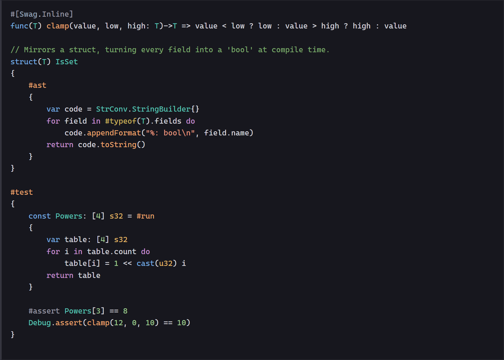

# Swag

Compiler-backed language support and a dark theme for Swag in Visual Studio Code.

# Screenshot

# Features

 - Syntax highlighting
 - Semantic highlighting of resolved types, functions, parameters, fields, and variables
 - Hover types, including inferred types, and inferred variable type inlay hints
 - Go to Definition, Peek Definition, references within the analyzed module, and document symbols
 - Compiler diagnostics for open files, updated after edits without saving
 - Theme 'Swag Dark', which uses the same token colors as the generated documentation,
   so code reads the same in the editor and on the language reference
 - Build, rebuild, and format tasks using `swc` from PATH

## Setup

Use VS Code 1.82 or newer and a compiler built from this revision. The language server finds
`swc` on PATH by default; no compiler path setting is required. If PATH was changed while
VS Code was running, close all VS Code windows and start it again to pick up the new environment.
Optionally set `swag.compilerPath` to an executable path to use a different compiler, such as
the checkout's `bin/swc.dm.exe`. An older compiler without `--editor-index` cannot provide
semantic features. Build tasks use `swc` from PATH.

Run `npm ci`, open this directory in VS Code, and launch the `Extension` configuration with
F5. In the development window, open a Swag module or an existing `.swg`/`.swgs` file.
Enable VS Code's **Editor: Inlay Hints** setting to show inferred types beside declarations.
Use **Swag: Restart Language Server** after rebuilding the compiler. The **Swag Language
Server** output channel contains the client log.

`swag.languageServer.enabled` enables semantic features. `analysisDelay` (default 500 ms)
and `analysisTimeout` (default 60 seconds) under `swag.languageServer` control background
analysis. Compiler execution is enabled only in trusted workspaces: Swag semantic analysis
can execute module setup and compile-time code. Syntax highlighting remains available in
untrusted workspaces.

## Analysis scope

The server finds the nearest ancestor `module.swg` and analyzes that module; a file outside
a module is analyzed on its own. Open buffers in that module replace the compiler's source
contents in memory. Unsaved buffers, the editor index, and the requested module working/output
directories live in a per-analysis system temporary directory. Dependencies use the compiler's
usual caches.
The server uses the standard LSP protocol and can also run as `node src/server.js --stdio`
with a `compilerPath` initialization option in another editor.

This first implementation keeps the LSP server alive and caches each module snapshot, but
starts a compiler process for each changed snapshot. It does not yet retain incremental
compiler state. Analyses are serialized and use at most six compiler workers; obsolete work
is cancelled and never published over a newer document version.

Semantic features require a successful module analysis. While the module has errors, compiler
diagnostics and TextMate highlighting remain available, but semantic answers are cleared.
References cover the current module. Imports use the compiler's on-disk dependency state;
unsaved edits in another module are not incorporated. Imported definitions currently navigate
to generated API source when that is the source the compiler loaded. Generated expansions
without a physical source mapping and ambiguous generic instances return no location.
Completion, rename, original-source mappings for imported APIs, and incremental compilation
are not implemented yet.

## Validation

Run `npm test` for task discovery, TextMate grammar, semantic positions, shadowing, overlays,
and analysis cancellation. After building the compiler, set `SWAG_TEST_COMPILER` to that
checkout's executable and run `npm run test:integration` for the LSP lifecycle, inferred
types, overload selection, cross-file definitions, unsaved edits, and diagnostic repair.

The bridge writes JSON with `version: 1`, source texts, and byte-based symbol occurrences
using `swc sema --editor-index <file>`. `--editor-overlay <file>` reads `SWAG-EDITOR-1\n`,
followed by pairs of UTF-8 path and source strings. Each string is preceded by its decimal
byte length and a newline; its exact bytes follow immediately, including for empty buffers.
Source paths retain their identity. The index is converted to LSP UTF-16 positions by the
server. These versioned formats are internal to the compiler/editor integration.
